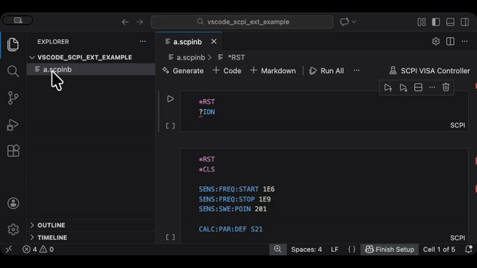

# SCPI Notebook

A comprehensive development and execution environment for SCPI (Standard Commands for Programmable Instruments) in VS Code.

## Features

### Language Support
- **Syntax Highlighting** - Full syntax highlighting for SCPI commands using Tree-sitter parser
- **Intelligent Code Completion** - Auto-completion for SCPI commands including:
  - Common SCPI commands (`*IDN`, `*RST`, `*CLS`, etc.)
  - Subsystem commands (`:SYSTem`, `:MEASure`, etc.)
  - Hierarchical command structure with parameter hints
- **Symbol Navigation** - Navigate through SCPI commands and symbols in your files
- **Diagnostics & Error Checking** - Real-time error detection and validation of SCPI syntax

### Interactive Notebooks
- **SCPI Notebooks** - Create and work with interactive `.scpinb` notebook files
- **Execute SCPI Commands** - Run SCPI commands directly in notebook cells
- **View Results** - See command outputs and responses inline
- **Notebook Toolbar** - Quick access to configuration commands

### Instrument Integration
- **Connection Configuration** - Configure instrument connections (VISA, TCP/IP, USB, etc.)
- **Python Environment Setup** - Configure Python interpreter with pyvisa support
- **VISA Adapter** - Built-in Python adapter for instrument communication via pyvisa

### AI & Context
- **AI Context Support** - Generate AI context for SCPI commands and workflows
- **Command Documentation** - Built-in descriptions and documentation for common SCPI commands

### Visual Enhancements
- **Custom File Icons** - Dedicated icon theme for `.scpinb` files
- **Extension Icon** - Professional icon for the extension marketplace

## Requirements

- VS Code version 1.96.0 or higher

## Extension Settings

This extension contributes the following settings:

* `scpi.pythonPath` - Path to the Python interpreter with pyvisa installed (default: `"python"`)

## Commands

The extension provides the following commands:

* **Get SCPI AI Context** - Generate AI context for SCPI commands
* **Configure Instrument Connection** - Set up instrument connection settings
* **Configure Python Environment** - Configure Python interpreter path

## Known Issues

None at this time.

## Usage

1. **Create a SCPI Notebook**: Create a new file with `.scpinb` extension
2. **Configure Connection**: Use the notebook toolbar to configure your instrument connection
3. **Write SCPI Commands**: Type SCPI commands in notebook cells with full IntelliSense support
4. **Execute Commands**: Run cells to execute SCPI commands and view results
5. **Get AI Context**: Use the command palette to generate AI context for your SCPI workflows

## Release Notes

### 0.0.1

- Updated extension name to "SCPI Notebook"
- Reorganized icons into assets folder
- Improved README with comprehensive feature list
- Initial release of SCPI Notebook extension

---

## Contributing

Contributions are welcome! Please feel free to submit a Pull Request.

## License

See LICENSE file for details.

